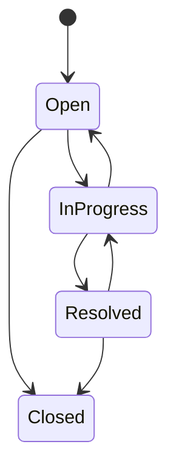

# SupportFlow API

API REST para gestão de chamados de suporte, criada como projeto de portfólio back-end com C# e ASP.NET Core.

O sistema permite cadastrar clientes, autenticar usuários, abrir chamados, atribuir responsáveis, controlar mudanças de status, registrar comentários e consultar dados com filtros e paginação.

## Tecnologias

- .NET 10 LTS e C#
- ASP.NET Core Web API
- Entity Framework Core
- SQLite
- autenticação e autorização com JWT
- Swagger / OpenAPI
- xUnit e Coverlet
- Docker
- GitHub Actions

## Funcionalidades

- cadastro e login de usuários;
- geração e validação de token JWT;
- perfis `Customer`, `Agent` e `Admin`;
- abertura e consulta de chamados;
- filtros por status, prioridade e texto;
- paginação de resultados;
- atribuição de chamados a agentes;
- transições de status com regras de negócio;
- comentários por chamado;
- controle de concorrência por versão;
- exclusão de chamados restrita a administradores;
- endpoint de verificação de saúde;
- documentação interativa com Swagger.

## Regras de acesso

| Operação | Customer | Agent | Admin |
|---|:---:|:---:|:---:|
| Criar chamado | Sim | Sim | Sim |
| Ver os próprios chamados | Sim | Sim | Sim |
| Ver todos os chamados | Não | Sim | Sim |
| Comentar em chamado permitido | Sim | Sim | Sim |
| Alterar status | Não | Sim | Sim |
| Atribuir responsável | Não | Sim | Sim |
| Excluir chamado | Não | Não | Sim |

## Fluxo de status



Depois de fechado, o chamado não pode ser alterado. Essa regra está implementada no modelo de domínio e coberta por testes.

## Como executar

### Pré-requisitos

- [.NET SDK 10](https://dotnet.microsoft.com/download/dotnet/10.0)
- Git

### Execução local

```bash
git clone https://github.com/jmmedeiross/supportflow-api.git
cd supportflow-api
dotnet restore SupportFlow.slnx
dotnet run --project src/SupportFlow.Api
```

Abra o endereço exibido no terminal seguido de `/swagger`, normalmente:

```text
http://localhost:5080/swagger
```

O banco SQLite é criado automaticamente na primeira execução.

### Usuários de demonstração

Somente no ambiente `Development`, a aplicação cria estes usuários:

| Perfil | E-mail | Senha |
|---|---|---|
| Admin | `admin@supportflow.local` | `Admin123!` |
| Agent | `agent@supportflow.local` | `Agent123!` |

Essas credenciais existem apenas para demonstração. Altere ou desative o seed antes de publicar a API.

### Testes

```bash
dotnet test SupportFlow.slnx
```

Para gerar cobertura:

```bash
dotnet test SupportFlow.slnx --collect:"XPlat Code Coverage"
```

### Docker

```bash
docker compose up --build
```

A API ficará disponível em `http://localhost:8080`.

## Endpoints principais

| Método | Endpoint | Acesso |
|---|---|---|
| `POST` | `/api/auth/register` | Público |
| `POST` | `/api/auth/login` | Público |
| `GET` | `/api/tickets` | Autenticado |
| `GET` | `/api/tickets/{id}` | Autenticado |
| `POST` | `/api/tickets` | Autenticado |
| `PATCH` | `/api/tickets/{id}/status` | Agent ou Admin |
| `PATCH` | `/api/tickets/{id}/assignment` | Agent ou Admin |
| `POST` | `/api/tickets/{id}/comments` | Autenticado |
| `DELETE` | `/api/tickets/{id}` | Admin |
| `GET` | `/health` | Público |

O arquivo `src/SupportFlow.Api/SupportFlow.Api.http` contém exemplos prontos de requisições.

## Estrutura

```text
SupportFlow/
├── src/SupportFlow.Api/
│   ├── Controllers/
│   ├── Data/
│   ├── Dtos/
│   ├── Extensions/
│   ├── Models/
│   └── Services/
├── tests/SupportFlow.Tests/
├── .github/workflows/ci.yml
├── Dockerfile
└── docker-compose.yml
```

## Decisões técnicas

- **SQLite:** facilita a execução local sem exigir um servidor de banco.
- **JWT:** permite proteger a API sem manter sessão no servidor.
- **DTOs:** evitam expor diretamente as entidades do banco.
- **Papéis:** demonstram autorização baseada em perfil.
- **Versionamento do chamado:** reduz o risco de sobrescrever uma alteração concorrente.
- **Modelo de domínio:** concentra as regras de transição de status na entidade `Ticket`.
- **CI:** executa restore, build e testes automaticamente a cada push ou pull request.

## Próximas evoluções

- migrations do Entity Framework Core;
- testes de integração dos endpoints;
- refresh token e recuperação de senha;
- PostgreSQL para produção;
- logs estruturados;
- front-end em React ou Angular;
- implantação em nuvem.

## Autor

João Manuel Medeiros Silveira

- LinkedIn: [linkedin.com/in/jmmedeiross](https://www.linkedin.com/in/jmmedeiross/)
- GitHub: [github.com/jmmedeiross](https://github.com/jmmedeiross)
